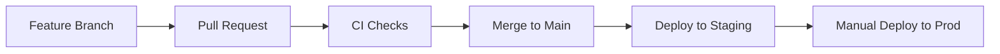

# 💅 Brenda Nails Studio

<div align="center">


**A modern, full-stack portfolio website built with serverless-first architecture**

[](https://www.typescriptlang.org/)
[](https://astro.build/)
[](https://reactjs.org/)
[](https://tailwindcss.com/)
[](https://aws.amazon.com/)
[](https://www.terraform.io/)

</div>

## 🏗️ Architecture Overview

This monorepo follows a **serverless-first approach** deployed on AWS, with clear separation of concerns and automated CI/CD pipelines. Built for scalability, performance, and maintainability.

## 📁 Project Structure

```
brenda-nails-studio/
├── 📱 apps/
│   ├── frontend/          # Astro + React + Tailwind CSS
│   └── backend/           # Node.js + Express + AWS Lambda
├── 📦 packages/
│   ├── shared/            # Common types, schemas & utilities
│   └── ui/                # Reusable UI components (shadcn/ui)
├── 🏗️ infra/
│   ├── int/               # Integration environment
│   ├── stage/             # Staging environment
│   └── prod/              # Production environment
├── 🔄 .github/workflows/  # CI/CD pipeline definitions
└── 🛠️ tools & configs     # Nx, TypeScript, Biome, etc.
```
## 🛠️ Technology Stack

### Frontend
- **[Astro](https://astro.build/)** - Modern web framework with component islands
- **[React](https://reactjs.org/)** - UI library for interactive components
- **[TypeScript](https://www.typescriptlang.org/)** - Type-safe JavaScript
- **[Tailwind CSS](https://tailwindcss.com/)** - Utility-first CSS framework
- **[shadcn/ui](https://ui.shadcn.com/)** - Beautiful, accessible UI components
- **[Zod](https://zod.dev/)** - Schema validation

### Backend
- **[AWS Lambda](https://aws.amazon.com/lambda/)** - Serverless compute functions
- **[API Gateway](https://aws.amazon.com/api-gateway/)** - HTTP APIs and routing
- **[Node.js](https://nodejs.org/)** + **TypeScript** - Runtime and development
- **[DynamoDB](https://aws.amazon.com/dynamodb/)** - NoSQL database
- **[Express](https://expressjs.com/)** - Web framework for local development

### Infrastructure
- **[AWS S3](https://aws.amazon.com/s3/)** - Static site hosting & storage
- **[CloudFront](https://aws.amazon.com/cloudfront/)** - CDN with HTTPS
- **[Terraform](https://www.terraform.io/)** - Infrastructure as Code
- **[GitHub Actions](https://github.com/features/actions)** - CI/CD pipelines

### Development Tools
- **[Nx](https://nx.dev/)** - Monorepo management & task orchestration
- **[pnpm](https://pnpm.io/)** - Fast, efficient package manager
- **[Biome](https://biomejs.dev/)** - High-performance linting & formatting
- **[Husky](https://typicode.github.io/husky/)** - Git hooks automation
- **[Vitest](https://vitest.dev/)** - Fast unit testing framework
## 🌐 Environments

| Environment | Purpose | URL |
|-------------|---------|-----|
| **int** | Integration & testing | `int.brendanails.com` |
| **stage** | Pre-production staging | `stage.brendanails.com` |
| **prod** | Production | `brendanails.com` |

## 🚀 Quick Start

### Prerequisites
- **Node.js** 20.16.0+ (managed via `.nvmrc`)
- **pnpm** 8.15.0+
- **AWS CLI** (for deployments)
- **Terraform** (for infrastructure)

### Getting Started

```bash
# 1. Clone the repository
git clone <repository-url>
cd brenda-nails-studio

# 2. Install dependencies
pnpm install

# 3. Start development servers
pnpm dev                    # All applications
# OR
pnpm nx serve frontend      # Frontend only (http://localhost:4321)
pnpm nx serve backend       # Backend only (http://localhost:3000)
```
## 🧪 Development & Testing

### Available Commands

```bash
# Development
pnpm dev                    # Start all applications
pnpm build                  # Build all projects
pnpm clean                  # Clean all build artifacts

# Code Quality
pnpm lint                   # Lint all projects
pnpm lint:fix              # Fix linting issues
pnpm format                # Format code with Biome
pnpm type-check            # TypeScript type checking

# Testing
pnpm test                  # Run all tests
pnpm test:watch           # Run tests in watch mode
```

### Testing Strategy
- **Frontend**: Vitest + Testing Library for component tests
- **Backend**: Vitest for unit/integration tests + AWS SDK mocks
- **E2E**: Playwright for end-to-end testing
- **Infrastructure**: Terraform validation & planning
## 📝 Commit Standards

This project follows [Conventional Commits](https://www.conventionalcommits.org/) specification:

```
type(scope): description

[optional body]

[optional footer]
```

### Types
- `feat` - New features
- `fix` - Bug fixes  
- `docs` - Documentation changes
- `style` - Code style changes
- `refactor` - Code refactoring
- `test` - Test additions/changes
- `chore` - Maintenance tasks

### Examples
```bash
feat(frontend): add appointment booking form
fix(backend): resolve validation error handling
docs: update deployment instructions
```
## 🚀 Deployment & CI/CD

### GitHub Actions Workflows

| Workflow | Trigger | Purpose |
|----------|---------|---------|
| **CI** | PR + Push | Lint, test, build |
| **Deploy Staging** | Push to `main` | Auto-deploy to staging |
| **Deploy Production** | Manual | Deploy to production |

### Deployment Flow



### Infrastructure as Code
- **Terraform** manages all AWS resources
- **Environment-specific** configurations (int/stage/prod)
- **OIDC integration** for secure, keyless deployments
- **State management** with S3 backend
## 🔧 Development Environment

### IDE Setup
Recommended VS Code extensions:
- **Biome** - Code formatting and linting
- **Nx Console** - Nx workspace management  
- **Astro** - Astro language support
- **Terraform** - Infrastructure code support
- **Tailwind CSS IntelliSense** - CSS class suggestions
### Git Hooks (Husky)
- **Pre-commit**: Code formatting and linting
- **Commit-msg**: Conventional commit validation
- **Pre-push**: Run tests

> 💡 **Tip**: VS Code debug configurations are pre-configured in `.vscode/launch.json`
## 🤝 Contributing

1. **Fork** the repository
2. **Create** a feature branch: `git checkout -b feat/your-feature`
3. **Make** your changes following the code standards
4. **Test** your changes thoroughly
5. **Commit** with conventional commit format
6. **Push** and create a pull request

### Code Review Process
- ✅ All pull requests require review
- ✅ CI checks must pass
- ✅ Maintain code coverage standards
- ✅ Follow established architecture patterns
## 📊 Features

### Current Implementation
- ✅ **Modern Frontend** - Astro + React + Tailwind CSS
- ✅ **Serverless Backend** - Node.js + Express + AWS Lambda ready
- ✅ **Type Safety** - Full TypeScript coverage
- ✅ **UI Components** - shadcn/ui component library
- ✅ **Monorepo Setup** - Nx workspace with shared packages
- ✅ **CI/CD Pipeline** - GitHub Actions with multi-environment support
- ✅ **Infrastructure** - Terraform for AWS resources

### Planned Features
- 🔄 **Appointment Booking** - Online scheduling system
- 🔄 **Gallery Management** - Portfolio showcase
- 🔄 **Contact Forms** - Client communication
- 🔄 **CMS Integration** - Content management system
- 🔄 **Performance Monitoring** - Analytics and observability

## 🔒 Security & Best Practices

- **OIDC Integration** - Keyless AWS deployments
- **IAM Least Privilege** - Minimal required permissions
- **Secrets Management** - AWS Systems Manager
- **Dependency Scanning** - Automated security updates
- **Code Quality** - Automated linting and formatting

## 📚 Resources

- [Nx Documentation](https://nx.dev/getting-started/intro)
- [Astro Documentation](https://docs.astro.build/)
- [Terraform AWS Provider](https://registry.terraform.io/providers/hashicorp/aws/latest/docs)
- [Conventional Commits](https://www.conventionalcommits.org/)

---

<div align="center">

**Built with ❤️ for Brenda Nails Studio**

[](https://opensource.org/licenses/MIT)

</div>